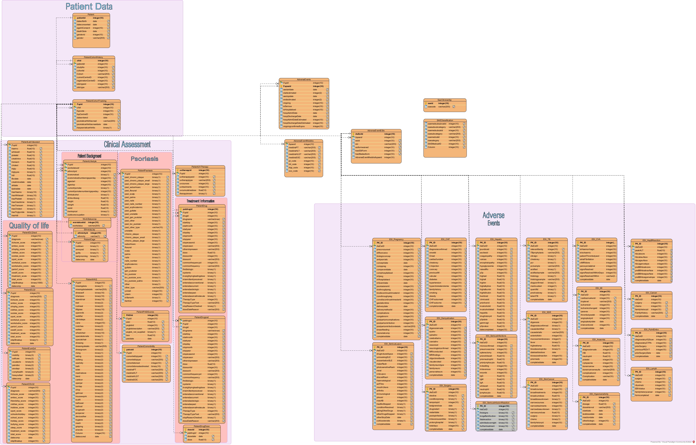

# 🧬 Clinical Database Schema Reference

This repository provides **visual schema representations** of three widely used UK-based clinical databases: **CPRD GOLD**, **CPRD AURUM**, and **BADBIR**.

Each schema is available in both **PDF** and **image (JPG)** formats, making it easy for researchers and analysts to reference the structure of these datasets visually.

---

## 📊 CPRD GOLD

**CPRD GOLD** is derived from general practices using the Vision system in the UK. It contains anonymized longitudinal medical records including:

- Diagnoses and symptoms  
- Medications prescribed  
- Referrals and test results  
- Lifestyle factors and demographics  

🔗 [View Full Schema (PDF)](CPRD%20GOLD.pdf)

---

## 📈 CPRD AURUM

**CPRD AURUM** is sourced from practices using the EMIS Web clinical system. It offers similar structure and content to CPRD GOLD but is distinct in its coding systems and data architecture.

It includes:

- Primary care clinical events  
- Drug prescriptions  
- Test results and referrals  
- Observations and immunizations  

🔗 [View Full Schema (PDF)](CPRD%20AURUM.pdf)

---

## 🧪 BADBIR

**BADBIR** (British Association of Dermatologists Biologic and Immunomodulators Register) is a UK-based registry that collects data on patients with psoriasis undergoing systemic therapies or biologics.

Schema components include:

- Patient registration and follow-up data  
- Drug exposure and dosage  
- Clinical outcomes and disease severity  
- Laboratory results and adverse events  

🔗 [View Full Schema (PDF)](BADBIR.pdf)

---

## 📂 Purpose of This Repository

This repository is intended to serve as a **quick visual reference** for database schemas used in UK healthcare research. It is particularly useful for:

- Researchers working with CPRD or BADBIR data  
- Data scientists building ETL pipelines or databases  
- Students and professionals learning about real-world clinical data

---

> 🔍 Feel free to fork this repository or open an issue if you want to contribute more schemas or enhance documentation.

